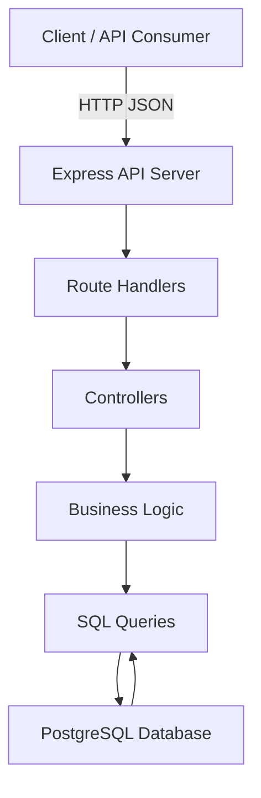

# Student Registration System

A RESTful backend for managing student registration, course enrollment, instructors, departments, semesters, and academic sessions. Built for educational institutions, this API centralizes student lifecycle data, department analytics, instructor assignments, and curriculum delivery for reporting and administration.

---

## Table of Contents

- [Overview](#overview)
- [Features](#features)
- [Tech Stack](#tech-stack)
- [Architecture Overview](#architecture-overview)
- [Project Structure](#project-structure)
- [Getting Started](#getting-started)
  - [Prerequisites](#prerequisites)
  - [Installation](#installation)
  - [Environment Variables](#environment-variables)
- [Database](#database)
- [API Documentation](#api-documentation)
- [Authentication & Authorization](#authentication--authorization)
- [Configuration](#configuration)
- [Development Workflow](#development-workflow)
- [Testing](#testing)
- [Deployment](#deployment)
- [Security Considerations](#security-considerations)
- [Performance Optimizations](#performance-optimizations)
- [Troubleshooting](#troubleshooting)
- [Contributing Guidelines](#Contributing-Guidelines)
- [Roadmap](#roadmap)
- [License](#license)
- [Contact](#Contact)

---

## Overview

This project is a backend system for student registration and academic management. It supports:

- student registration and profile management
- department and course administration
- instructor records and course assignments
- semester and session scheduling
- course enrollment tracking and analytics

The API is designed for academic administrators, registrar offices, education platform developers, and data teams that need structured student and course data.

---

## Features

### Student Features

- Register new students
- Retrieve student profiles by ID
- List students with pagination and sorting
- Update student details
- Deactivate student records

### Department Features

- Create and manage departments
- Retrieve department details
- List departments with pagination and sorting
- Delete departments
- Fetch student counts per department

### Course Features

- Create and manage courses
- Retrieve course details and full course analytics
- List courses globally, by department, and by semester
- Fetch most popular courses
- Find courses without assigned instructors

### Instructor Features

- Register and manage instructors
- Assign instructors to courses
- Retrieve instructor assignments and department listings
- Deactivate instructor records

### Enrollment Features

- Enroll students in courses
- Manage enrollment status
- Query students by department, course, and enrollment status
- Find students without current enrollment
- Count students across departments

### System Features

- PostgreSQL database backend
- Express.js REST API
- JSON request parsing and CORS support
- Input validation and error handling
- Pagination support for list endpoints

---

## Tech Stack

| Category | Technology |
| --- | --- |
| Backend | Node.js, Express.js |
| Database | PostgreSQL |
| ORM / Client | `pg` |
| Configuration | `dotenv` |
| Validation | `validator`, custom validators |
| Middleware | `cors` |
| Dev Tools | `nodemon` |

---

## Architecture Overview

The backend is a classic Node.js REST API layered in:

- `routes` define HTTP endpoints
- `controllers` translate requests into service calls
- `Services` implement business logic and validation
- `Queries` execute parameterized PostgreSQL SQL statements
- `db/index.js` manages the PostgreSQL connection pool

Client requests arrive at Express routes and flow through controllers into service logic and query execution.



---

## Project Structure

```
src/
├── app.js
├── constants.js
├── index.js
├── controllers/
│   ├── course.controller.js
│   ├── department.controller.js
│   ├── enrollment.controller.js
│   ├── instructor.controller.js
│   ├── semester.controller.js
│   └── student.controller.js
├── db/
│   └── index.js
├── models/
│   ├── course.model.sql
│   ├── department.model.sql
│   ├── enrollments.model.sql
│   ├── instructor.model.sql
│   ├── semester.model.sql
│   ├── semester_session.model.sql
│   └── student.model.sql
├── Queries/
│   ├── analytics.queries.js
│   ├── course.queries.js
│   ├── department.queries.js
│   ├── enrollment.queries.js
│   ├── instructor.queries.js
│   ├── semester.queries.js
│   └── student.queries.js
├── routes/
│   ├── course.routes.js
│   ├── department.routes.js
│   ├── enrollment.routes.js
│   ├── instructor.routes.js
│   ├── semester.routes.js
│   └── student.routes.js
├── Services/
│   ├── course.services.js
│   ├── department.services.js
│   ├── enrollment.services.js
│   ├── instructor.services.js
│   ├── semester.services.js
│   └── student.services.js
└── utils/
    ├── apiError.js
    ├── apiResponse.js
    ├── asyncHandler.js
    ├── emailValidator.js
    └── validateRequiredFields.js
```

### Folder Purpose

- `controllers/`: Map HTTP requests to service operations
- `Queries/`: Raw SQL statements and database access
- `Services/`: Business rules, validation, and response formatting
- `db/`: PostgreSQL pool configuration
- `utils/`: Shared helpers for validation and error formatting
- `models/`: SQL DDL for the database schema

---

## Getting Started

### Prerequisites

- Node.js 18+ or compatible runtime
- npm
- PostgreSQL database
- Git

### Installation

```bash
git clone <repository-url>
cd Student_registration-system
npm install
```

---

### Environment Variables

Create a `.env` file in the project root with the following variables:

| Variable | Purpose | Required |
| --- | --- | --- |
| `PORT` | Server port for Express | No (default `8000`) |
| `CORS_ORIGIN` | Allowed origin for CORS | No |
| `DB_USER` | PostgreSQL username | Yes |
| `DB_HOST` | PostgreSQL host | Yes |
| `DATABASE` | PostgreSQL database name | Yes |
| `DB_PASSWORD` | PostgreSQL password | Yes |
| `DB_PORT` | PostgreSQL port | Yes |

Example:

```env
PORT=8000
CORS_ORIGIN=http://localhost:3000
DB_USER=postgres
DB_HOST=127.0.0.1
DATABASE=student_registration
DB_PASSWORD=secret
DB_PORT=5432
```

---

## Database

### Technology

- PostgreSQL

### Schema Overview

The schema models a student registration system with the following entities:

- `student`
- `department`
- `course`
- `instructor`
- `semester`
- `semester_session`
- `enrollment`
- `instructor_course`

### Important Tables

- `student`: stores profile, contact, gender, birth date, enrollment year, and status
- `department`: stores department name, building, and office
- `course`: stores course code, name, credits, and department association
- `instructor`: stores instructor profile, email, hire date, status, and department assignment
- `semester`: stores semester numbers 1-8
- `semester_session`: links a semester, academic year, course, and schedule window
- `enrollment`: records student enrollment in a course for a semester session
- `instructor_course`: many-to-many instructor-to-course assignments

### Entity Relationship Diagram


### Relationship Notes

- `course.department_id` references `department.department_id`
- `instructor.department_id` references `department.department_id` and is marked unique in schema
- `semester_session` links `semester` to a `course`
- `enrollment` links students to course offerings in a semester session
- `instructor_course` supports many-to-many assignments between instructors and courses

---

## API Documentation

API base path: `/api/v1`

### Students

- `POST /api/v1/student/register` — Create a new student
- `GET /api/v1/student/:id` — Get student by UUID
- `GET /api/v1/student` — Get all students with pagination and sorting
- `PATCH /api/v1/student/:id` — Update student details
- `DELETE /api/v1/student/:id` — Deactivate a student

### Departments

- `POST /api/v1/department/register` — Create a new department
- `GET /api/v1/department/:id` — Get department by UUID
- `GET /api/v1/department` — Get all departments with pagination and sorting
- `PATCH /api/v1/department/:id` — Update department details
- `DELETE /api/v1/department/:id` — Delete department
- `GET /api/v1/department/student-count` — Get student count per department

### Courses

- `POST /api/v1/course/register` — Create a new course
- `GET /api/v1/course/:id` — Get course by UUID
- `GET /api/v1/course` — Get all courses with pagination and sorting
- `PATCH /api/v1/course/:id` — Update course details
- `DELETE /api/v1/course/:id` — Delete a course
- `GET /api/v1/course/details/:id` — Get full course details with department, instructor, and enrollment counts
- `GET /api/v1/course/department/:id` — Get courses for a department
- `GET /api/v1/course/semester` — Get courses grouped by semester and academic year
- `GET /api/v1/course/instructor/:id` — Get courses taught by instructor
- `GET /api/v1/course/analytics/most-popular` — Get most popular course by enrollment
- `GET /api/v1/course/no-instructor` — Get courses with no instructor assignment

### Instructors

- `POST /api/v1/instructor/register` — Create an instructor
- `GET /api/v1/instructor/:id` — Get instructor by UUID
- `GET /api/v1/instructor` — Get all instructors with pagination and sorting
- `PATCH /api/v1/instructor/:id` — Update instructor details
- `DELETE /api/v1/instructor/:id` — Deactivate an instructor
- `GET /api/v1/instructor/department` — Get instructors grouped by department
- `POST /api/v1/instructor/assignCourse/:instructorId/:courseId` — Assign a course to an instructor
- `GET /api/v1/instructor/instructorCourse/:id` — Get courses assigned to an instructor
- `PATCH /api/v1/instructor/instructorCourse/:id` — Update an instructor-course assignment

### Semesters

- `POST /api/v1/semester` — Create a semester
- `GET /api/v1/semester` — Get all semesters with pagination and sorting
- `GET /api/v1/semester/:id` — Get semester by UUID
- `PATCH /api/v1/semester/:id` — Update a semester
- `DELETE /api/v1/semester/:id` — Delete a semester
- `POST /api/v1/semester/semesterSession` — Create a semester session
- `GET /api/v1/semester/semesterSession/:id` — Get semester session by UUID
- `PATCH /api/v1/semester/semesterSession/:id` — Update a semester session
- `DELETE /api/v1/semester/semesterSession/:id` — Delete a semester session

### Enrollments

- `POST /api/v1/enrollments/register` — Create a student enrollment
- `GET /api/v1/enrollments/:id` — Get enrollment by UUID
- `PATCH /api/v1/enrollments/:id` — Update enrollment status or session
- `DELETE /api/v1/enrollments/:id` — Delete enrollment
- `GET /api/v1/enrollments/department/:id/students` — Get students enrolled in a department
- `GET /api/v1/enrollments/department/student-count` — Count students per department
- `GET /api/v1/enrollments/courses/students` — List student enrollments grouped by course
- `GET /api/v1/enrollments/course/:id/students` — Get students enrolled in a specific course
- `GET /api/v1/enrollments/students/without-enrollment` — Get students without active enrollment

---

## Authentication & Authorization

No authentication or authorization system is implemented in this repository. All endpoints are currently open and rely on UUIDs and request validation for resource access.

---

## Configuration

- `package.json` defines project dependencies and the `dev` script.
- `src/app.js` configures Express middleware and mounts route modules.
- `src/index.js` loads environment variables, connects to PostgreSQL, and starts the server.
- `src/db/index.js` uses `pg.Pool` with environment variables for database connections.

No Docker or CI/CD configuration is present.

---

## Development Workflow

### Start development server

```bash
npm run dev
```

This uses `nodemon` to restart the server automatically on source changes.

### Database setup

The repository contains SQL DDL files in `src/models/` for table creation. Apply these files manually in PostgreSQL to build the schema.

### Hot reload

`nodemon` monitors files and reloads the server when code changes.


---

## Deployment

To deploy manually:
1. Provision a PostgreSQL instance.
2. Configure environment variables.
3. Install dependencies: `npm install`.
4. Start the application in production mode with a process manager such as `pm2` or `node src/index.js`.

---

## Security Considerations

- SQL queries use parameterized values via `pg`.
- Required fields are validated before insert/update operations.
- Email values are validated using a regex helper.
- UUID route parameters are validated before resource access.

Current security gaps:

- No authentication or role-based access control
- No rate limiting
- No request schema enforcement via OpenAPI or JSON Schema

---

## Performance Optimizations

- List endpoints support pagination using `OFFSET` and `FETCH FIRST`.
- Selected analytics queries use SQL aggregation and `COUNT(*) OVER()` to retrieve totals efficiently.
- The API avoids inline string concatenation in SQL to reduce injection risk.

---

## Troubleshooting

### Database connection issues

Problem: App fails when connecting to PostgreSQL.

Solution:

- Confirm `DB_HOST`, `DB_USER`, `DATABASE`, `DB_PASSWORD`, and `DB_PORT` are set correctly.
- Ensure PostgreSQL is running and the user has access.
- Check that the target database exists.

### Invalid UUID errors

Problem: Requests return `Invalid UUID`.

Solution: Verify the resource ID is a valid PostgreSQL UUID string.

### Missing required fields

Problem: Requests return `Missing required fields`.

Solution: Ensure required JSON keys are included and not empty in request bodies.

---

## Roadmap

- [ ] Add authentication and authorization
- [ ] Add automated tests
- [ ] Add API schema validation and Swagger/OpenAPI documentation
- [ ] Add database migration and seed scripts
- [ ] Add frontend or admin dashboard UI
- [ ] Harden security with rate limiting and request sanitization
- [ ] Fix instructor course assignment route mismatch

---

## Contributing Guidelines

- Fork this repository and work on a feature branch.
- Keep commits small, descriptive, and meaningful.
- Use the existing code style and project conventions.
- Update or add documentation for new features.
- Submit pull requests with clear summaries and testing notes.

---

## License

This project is licensed under the **ISC License**.

---

## Contact

- GitHub: [Chitrakar09](https://github.com/Chitrakar09)
- Repository: [https://github.com/Chitrakar09/Student_Registration_System](https://github.com/Chitrakar09/Student_Registration_System)

---